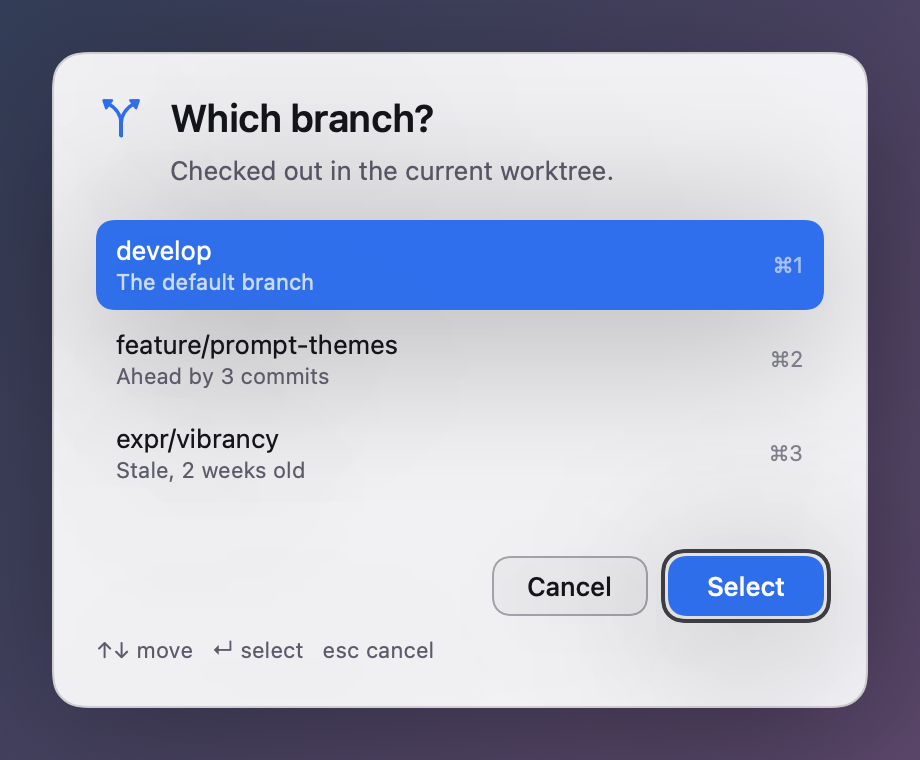
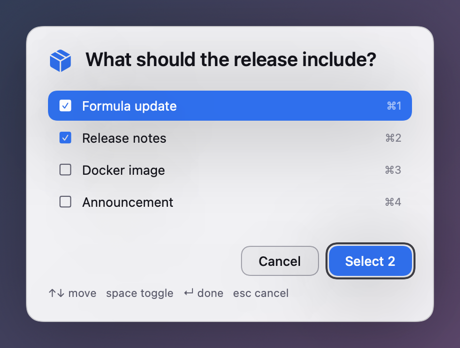
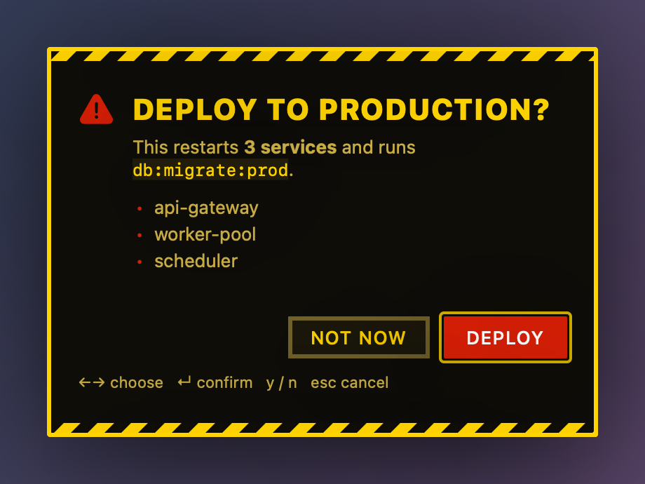
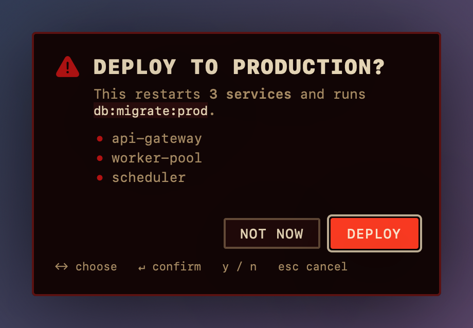
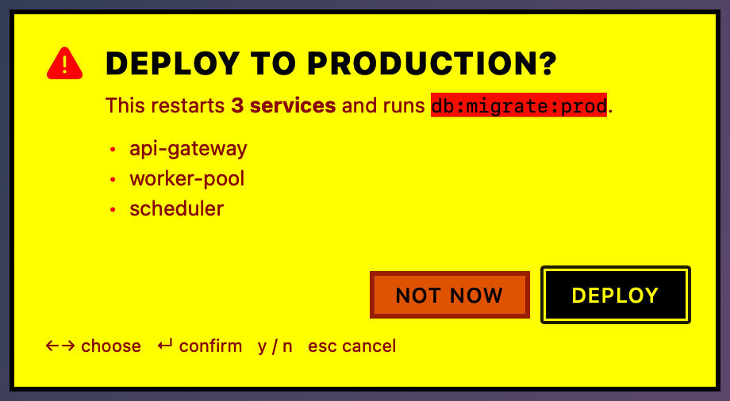
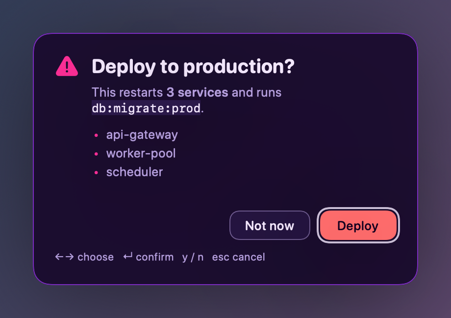
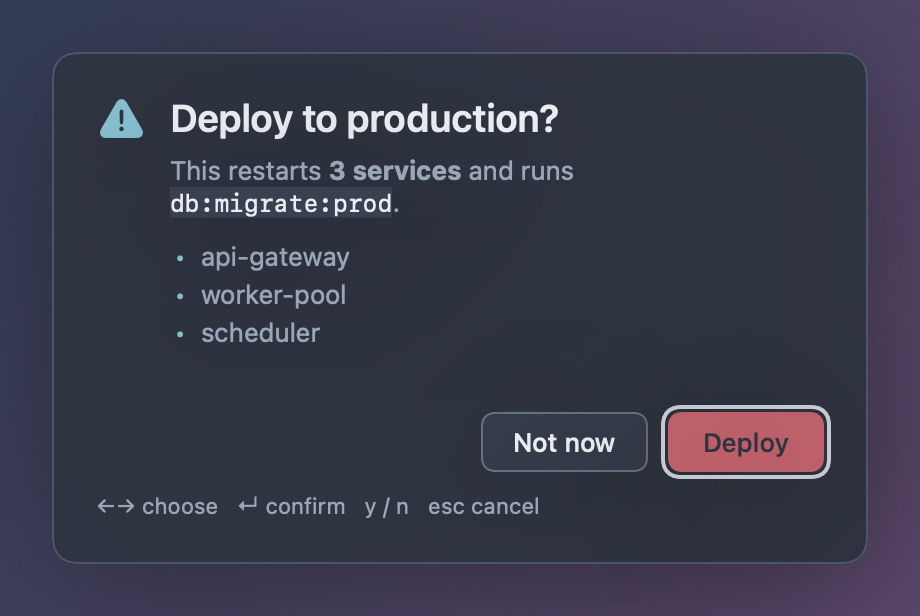
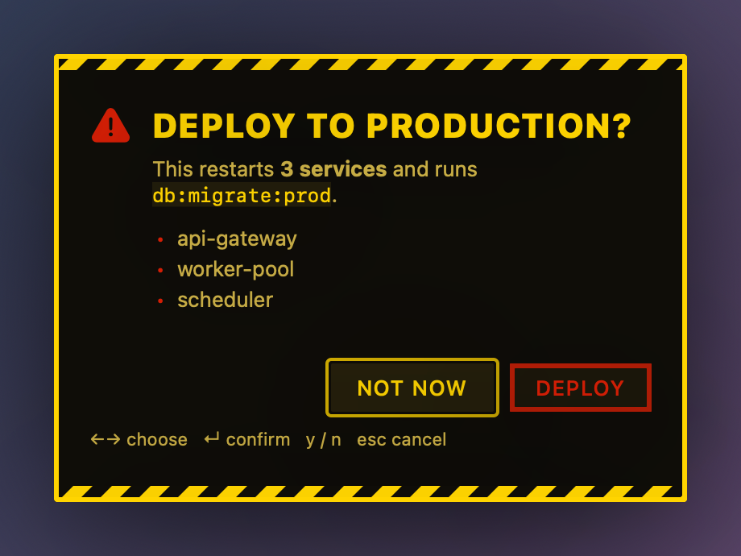
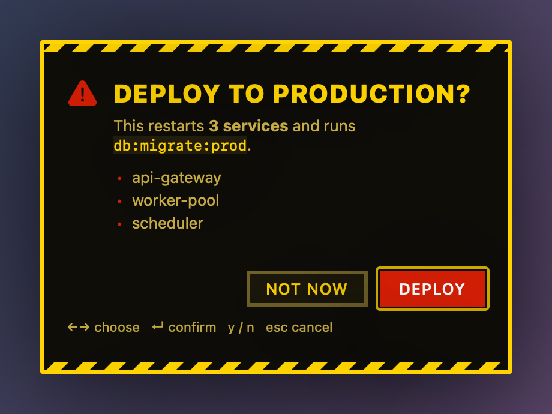

# prettyprompt

**Beautiful macOS prompts for shell scripts.** Ask a question from a script and get a
themed panel dead centre on the display you're looking at, floating above everything
else, with the answer on stdout.

It's `dialog` for the Mac, if `dialog` had been designed this decade.

<p align="center">
  
</p>

```bash
if prettyprompt confirm "Deploy to production?" --theme danger --destructive; then
  ./deploy.sh
fi
```

---

## Install

```bash
brew install jclement/tap/prettyprompt
```

Requires macOS 14 or newer, and a logged-in desktop session — prettyprompt draws a
window, so it won't work over a bare SSH connection or from a root launchd daemon.

<details>
<summary>From source</summary>

```bash
git clone https://github.com/jclement/prettyprompt
cd prettyprompt
mise run setup
mise run install     # → ~/.local/bin/prettyprompt
```
</details>

---

## The five prompts

### `confirm` — yes or no

Exits **0** for yes and **1** for no, so it drops straight into an `if`.

```bash
prettyprompt confirm "Delete 47 stale branches?" --destructive
prettyprompt confirm "Continue?" --yes "Keep going" --no "Stop" --default-no
```

| Flag | Meaning |
|---|---|
| `--yes <label>` | Label for the affirmative button (default `OK`) |
| `--no <label>` | Label for the negative button (default `Cancel`) |
| `--default-no` | Focus the negative button, so Enter says no |
| `--destructive` | Paint the affirmative button in the theme's danger colour |

### `choose` — pick one

Prints the chosen value.

```bash
env=$(prettyprompt choose "Deploy where?" -o staging -o production)

# options can come from stdin, one per line
branch=$(git branch --format='%(refname:short)' | prettyprompt choose "Check out?")

# a tab adds a dimmed description
printf 'prod\tRestarts 3 services\nstaging\tSafe\n' | prettyprompt choose "Where?"
```

| Flag | Meaning |
|---|---|
| `-o, --option <text>` | An option. Repeat for each one |
| `--multiple` | Allow more than one selection |
| `--select <value>` | Start with this option selected. Repeat with `--multiple` |
| `--limit <n>` | With `--multiple`, the most that can be selected |
| `--index` | Print the 0-based position instead of the value |
| `--filter` | Always show the filter field, however short the list |

Lists longer than seven rows get a filter field and scroll; shorter lists don't.
`⌘1`…`⌘9` jump straight to a row.

### `choose --multiple` — pick several

Prints one value per line.

```bash
prettyprompt choose "Include in the release?" --multiple \
  -o "Formula update" -o "Release notes" -o "Docker image" \
  --select "Release notes" \
  | while read -r item; do echo "→ $item"; done
```

<p align="center">
  
</p>

### `input` — a line of text

Prints what was typed.

```bash
name=$(prettyprompt input "Branch name?" --placeholder "feature/…") || exit 1
token=$(prettyprompt input "API token" --password)
notes=$(prettyprompt input "Release notes" --multiline --required)
```

| Flag | Meaning |
|---|---|
| `--placeholder <text>` | Greyed-out hint in the empty field |
| `--value <text>` | Pre-fill the field |
| `-p, --password` | Mask what is typed |
| `--multiline` | A resizable text area. Enter adds a line, `⌘↩` submits |
| `--required` | Refuse to submit an empty answer |

### `alert` — say something

No question, one button. For the moment a long script needs you to look up.

```bash
make || prettyprompt alert "Build failed" --icon ⚠️ --sound
prettyprompt alert "Backup finished" -b "Nice" --timeout 30
```

---

## Flags every prompt understands

| Flag | Meaning |
|---|---|
| `-m, --message <text>` | A supporting line under the title. **Markdown** — see below |
| `--icon <icon>` | An emoji, or an SF Symbol name like `exclamationmark.triangle.fill` |
| `--theme <name>` | One of the built-ins, or one of yours |
| `--width <points>` | Panel width, 260–1200 (default 460) |
| `-t, --timeout <seconds>` | Give up after this long |
| `--on-timeout <cancel\|accept>` | `cancel` exits 124 (default); `accept` submits the current answer |
| `--insist` | Remove every way out. Esc will not dismiss the prompt |
| `--sound` / `--no-sound` | Play a sound. **On by default for `confirm --destructive`** |
| `--sound-name <name>` | Which sound. See `prettyprompt sounds`. Implies `--sound` |
| `--json` | Print a JSON object instead of a bare answer |
| `--screen <where>` | `mouse` (default), `focused`, or a 0-based display index |

### Markdown in `--message`

Bold, italics, `code`, links, real newlines and bullet lists:

```bash
prettyprompt confirm "Deploy to production?" --theme danger --message \
'This restarts **3 services** and runs `db:migrate:prod`.

- api-gateway
- worker-pool
- scheduler

Check the [runbook](https://example.com) first.'
```

<p align="center">
  
</p>

Fenced code blocks work too:

````bash
prettyprompt alert "Run this by hand" --message '```
kubectl rollout undo deploy/api
```'
````

---

## Sounds

A destructive confirm makes noise unless you tell it not to — the point of
`--destructive` is that it should be hard to answer without noticing.

```bash
prettyprompt confirm "Drop the database?" --theme danger --destructive   # thuds
prettyprompt confirm "Drop the database?" --destructive --no-sound       # doesn't
prettyprompt alert "Build finished" --sound                              # opts in
prettyprompt alert "Build finished" --sound-name Hero                    # picks one
```

Each theme has its own voice, so `--sound` sounds like the theme you asked for:

| Theme | Sound | |
|---|---|---|
| `danger` | Basso | the deep error thud |
| `doom` | Sosumi | |
| `hotdog` | Funk | |
| `matrix` | Submarine | sonar ping |
| `synthwave` | Bottle | |
| `nord` | Glass | |
| `paper` | Pop | |
| `terminal` | Tink | |
| everything else | Ping | neutral |

`prettyprompt sounds` lists all fourteen and which themes use them;
`prettyprompt sounds Basso` plays one; `prettyprompt sounds --all` plays the lot.
They come from `/System/Library/Sounds` rather than being bundled — they're the
ones every Mac already has, so there's nothing to ship and nothing to license.

Set a default in the config file with `"sound": true`, and override every
theme's voice with `"soundName": "Hero"`.

---

## Exit codes

The contract shell scripts program against. It will not change.

| Code | Meaning |
|---|---|
| `0` | Answered. For `confirm`, the answer was **yes** |
| `1` | `confirm` only: the answer was **no**. This is an answer, not an error |
| `2` | Usage error — bad flags, unknown theme, nothing to choose from |
| `70` | Something went wrong: no window server, unreadable config |
| `124` | `--timeout` elapsed |
| `130` | Cancelled with Esc |

Runtime failures use `70` rather than `1` precisely so that `confirm` can spend `1` on a
real answer. **A cancelled or timed-out prompt prints nothing at all**, so a bare
`$(...)` capture is always either a real answer or empty:

```bash
name=$(prettyprompt input "Name?") || exit 1     # Esc → exits here
[ -n "$name" ] || exit 1                          # or check for empty
```

With `--json` every outcome is reported explicitly instead:

```json
{"status":"ok","value":"production","values":["production"],"indexes":[0]}
{"status":"ok","confirmed":true}
{"status":"cancelled"}
{"status":"timeout"}
```

---

## Themes

Eleven built in. `prettyprompt themes` lists them; `prettyprompt themes <name>` opens a
sample prompt so you can look at it.

| | | |
|---|---|---|
| **auto** — follows the system | **dark** | **light** |
| **danger** — caution tape, for questions that deserve a pause | **doom** — rip and tear | **hotdog** — Windows 3.1's greatest crime |
| **matrix** — phosphor green | **synthwave** — Miami sunset | **nord** — cold and calm |
| **paper** — warm stock, serif | **terminal** — square, monospace | |

<p align="center">
  
  
</p>
<p align="center">
  
  
</p>

### Your own

Themes are JSON. Start from a built-in and edit it:

```bash
mkdir -p ~/.config/prettyprompt/themes
prettyprompt themes --export nord > ~/.config/prettyprompt/themes/mine.json
prettyprompt themes mine
```

The file name is the theme name. Every colour is `#RRGGBB` or `#RRGGBBAA`:

```json
{
  "name": "mine",
  "summary": "Mine",
  "appearance": "dark",
  "dark": {
    "background": "#1A1B26F2",
    "surface":    "#FFFFFF14",
    "foreground": "#C0CAF5",
    "secondary":  "#7982A9",
    "accent":     "#7AA2F7",
    "accentForeground": "#1A1B26",
    "border":     "#FFFFFF24",
    "danger":     "#F7768E"
  },
  "light": { "…": "same keys" },
  "style": {
    "cornerRadius": 14,
    "borderWidth": 1,
    "material": true,
    "fontFamily": "system",
    "titleSize": 19,
    "titleWeight": "semibold",
    "uppercaseTitle": false,
    "hazardStripes": false,
    "shadowRadius": 40,
    "shadowOpacity": 0.34
  }
}
```

`appearance` is `system` (pick `light` or `dark` to match macOS), or `light` / `dark` to
pin it. `fontFamily` is `system`, `monospaced`, `rounded` or `serif`. Built-in names win,
so you can't shadow `dark` with your own.

---

## Config file

`~/.config/prettyprompt/config.json` — every key optional, every key overridable by a
flag.

```json
{
  "theme": "nord",
  "width": 520,
  "sound": false,
  "soundName": "Hero",
  "timeout": 120,
  "screen": "mouse"
}
```

| Key | Effect |
|---|---|
| `theme` | Default `--theme` |
| `width` | Default `--width` |
| `sound` | Play a sound on every prompt, not just destructive ones |
| `soundName` | Override every theme's voice |
| `timeout` | A global safety net for unattended scripts |
| `screen` | Default `--screen` |

---

## Keyboard

| | `choose` | `input` | `confirm` | `alert` |
|---|---|---|---|---|
| Move | `↑` `↓`, `j` `k` | — | `←` `→`, `⇥` | — |
| Select / toggle | `↵`, `space` (multi) | — | `y` / `n` | — |
| Jump | `⌘1`…`⌘9` | — | — | — |
| Filter | type | — | — | — |
| Submit | `↵` | `↵` (`⌘↩` multiline) | `↵` | `↵`, `space` |
| Cancel | `esc`, `⌘.` | `esc`, `⌘.` | `esc`, `⌘.` | `esc`, `⌘.` |

`--insist` removes cancellation entirely.

The focused button is the filled one, so `←`/`→` visibly moves a solid block
between them. `--default-no` focuses Cancel, which is what you want on anything
destructive:

<p align="center">
  
  
</p>

---

## Recipes

**Gate a dangerous command in a git hook**

```bash
#!/bin/sh
# .git/hooks/pre-push
branch=$(git rev-parse --abbrev-ref HEAD)
case "$branch" in
  main|develop)
    prettyprompt confirm "Push directly to $branch?" \
      --theme danger --destructive --yes "Push" --insist || exit 1
    ;;
esac
```

**Let a long build tell you it's done**

```bash
mise run build && prettyprompt alert "Build finished" --icon 🎉 --timeout 60 \
  || prettyprompt alert "Build failed" --icon 💥 --sound
```

**Pick a container to shell into**

```bash
container=$(docker ps --format '{{.Names}}\t{{.Image}}' \
  | prettyprompt choose "Exec into which container?" --filter) \
  && docker exec -it "$container" sh
```

**Ask with a deadline, and default to the safe answer**

```bash
prettyprompt confirm "Restart the database?" \
  --default-no --timeout 30 --on-timeout accept --destructive
```

**Give an agent a way to ask you something**

```bash
answer=$(prettyprompt input "The agent needs a decision" \
  --message "It wants to **force-push** to \`develop\`. Type 'yes' to allow." \
  --theme danger --timeout 300)
```

---

## How it works

A `.app` bundle with `LSUIElement`, so there's no Dock icon and no ⌘-Tab entry, plus a
two-line shim in `bin` that `exec`s the executable inside it. The bundle is what lets a
process launched from a terminal take keyboard focus and float above full-screen apps;
the `exec` is what keeps stdout, stderr and the exit code wired to the caller.

The panel opens on the display containing the mouse pointer — the best available proxy
for "the screen you're looking at" — centred on its visible frame, at `.modalPanel`
level with `canJoinAllSpaces`.

[DESIGN.md](DESIGN.md) has the architecture and the reasoning behind the decisions.

---

## Development

```bash
mise run setup     # zero → runnable
mise run dev       # build and show a sample prompt
mise run check     # lint + test — the gate
mise run gallery   # regenerate docs/gallery from the code
mise run release   # tag a release; CI builds and publishes it
```

| Task | Does |
|---|---|
| `setup` | Resolve dependencies, build the debug bundle |
| `dev` | Build and show a sample prompt |
| `build` | Release build of `PrettyPrompt.app` |
| `test` | Full suite |
| `lint` | Typecheck + `swift format lint --strict`. Never mutates |
| `fmt` | The mutating counterpart |
| `check` | `lint` + `test` |
| `install` | Install to `~/.local/bin/prettyprompt` |
| `gallery` | Re-render `docs/gallery` |
| `clean` / `dev:reset` | Remove build artifacts / and local config |
| `release` | Interactive tag bump |

---

## License

MIT © 2026 Jeff Clement
